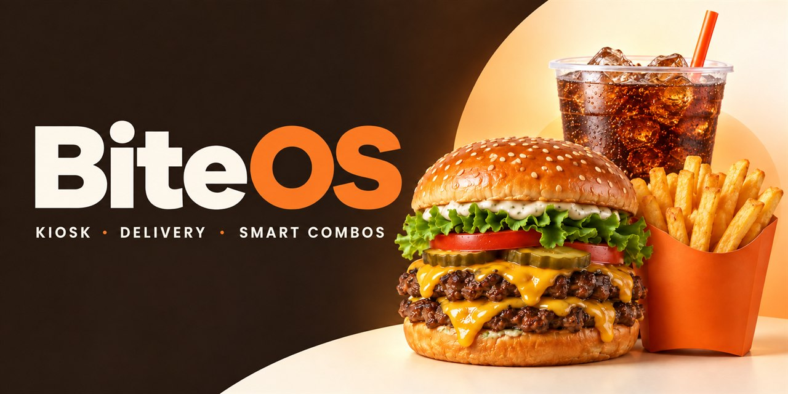

# BiteOS

**Restaurant ordering for a big touchscreen and a browser delivery demo.** BiteOS lets guests build a meal, compare combos, and choose relevant add-ons with the price visible before they confirm.

[](https://safal207.github.io/biteos/)

**[Try the live demo](https://safal207.github.io/biteos/)** · **[Open the kiosk](https://safal207.github.io/biteos/#kiosk)** · [Read in Russian](README.ru.md)

[](https://github.com/safal207/biteos/actions/workflows/check.yml) · [MIT license](LICENSE)

## See it in action

- **Guest:** choose a restaurant, browse its menu, build a cart, add or remove a matching side or drink, and see the exact extra cost. Discounted combo cards show their contents, separate-item price, and savings.
- **Checkout:** accept one relevant add-on or decline it; a single cheaper alternative may follow. Nothing is added without the guest choosing it.
- **Restaurant and courier:** try menu edits, offer rules, a preparation countdown, pickup, and delivery in a single-tab simulation.
- **Kiosk:** use a touch-friendly menu with modifiers, combos, cart controls, and contextual suggestions. The local stack can save demo orders.

The live site has four sample restaurants, including Bite Burger and Roby's Coffee House. Fast-food prices are shown in ₽ and Roby's menu prices in ₺. The restaurant and courier screens are interactive demos, not connected to real businesses or drivers.

## How it works

| Surface | What runs |
| --- | --- |
| [GitHub Pages demo](https://safal207.github.io/biteos/) | React and a browser-only demo adapter. Its delivery data stays in the current tab; kiosk orders last until reload. |
| Local kiosk | React + TypeScript frontend, Go API for catalog, quotes, and demo order storage, and a Rust service for deterministic suggestions. |

Go is the source of truth for kiosk prices. Rust reads the current catalog and proposes suitable items; it does not set prices. If the recommendation service is unavailable, local ordering still works without suggestions. The rules are explainable and do not use an LLM or personal data.

## Run locally

Install Node.js 24+, pnpm 11.19.0, Go 1.21+, and Rust 1.93+ with a working system linker. From the repository root:

```sh
corepack enable
corepack prepare pnpm@11.19.0 --activate
pnpm --dir apps/kiosk install --frozen-lockfile
node scripts/dev.mjs
```

Open **http://127.0.0.1:5173** after the three services start. The first Rust build can take a while. On Windows, use the Rust MSVC toolchain and Visual Studio C++ Build Tools; [the Russian guide](README.ru.md#быстрый-старт) includes a session-only toolchain example. You can also run `docker compose up --build` and open **http://127.0.0.1:8090**.

Run the project checks and build with:

```sh
node scripts/test.mjs
node scripts/build.mjs
```

The test script checks the Go API, Rust rules, React type/build output, and frontend behavior. CI also runs Go's race detector. For a browser-only preview, run `pnpm --dir apps/kiosk build:pages`; the published version is built from `main` by [GitHub Actions](.github/workflows/pages.yml).

## Project map

```text
apps/kiosk/             React UI for delivery and kiosk
services/api/           Go catalog, pricing, and local demo orders
services/recommender/   Rust suggestion rules
scripts/                Development, checks, and build
docs/                   Product scope and asset provenance
```

This is a working prototype, **not a production POS or delivery service**. The public demo has no shared server, accounts, payments, real dispatch, or cross-device order state. The local JSON order store is for a single-process demo, not a live restaurant. Prices, addresses, timing, and menu availability are illustrative. Read the [product scope](docs/product.md) and [full Russian guide](README.ru.md) for the boundaries and API details.

## Contribute and reuse

Issues and focused pull requests are welcome; [CONTRIBUTING.md](CONTRIBUTING.md) has setup and check commands. Original BiteOS code is [MIT-licensed](LICENSE). Roby's photos and other third-party assets are **not covered by that grant**; see [NOTICE.md](NOTICE.md) and [asset provenance](docs/assets.md) before reusing media or brand material.
