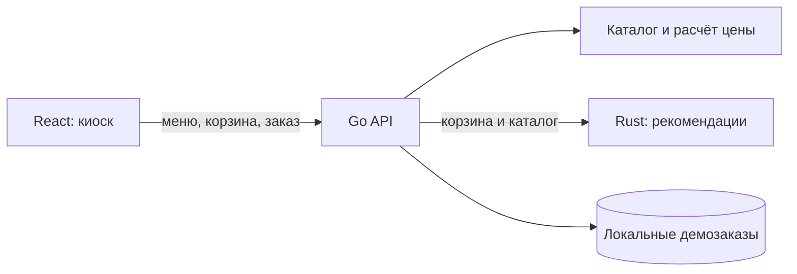

# BiteOS

**Есть идея. Есть бургер.** Умное меню для киосков самообслуживания и больших сенсорных экранов в фастфуде.

React показывает меню, Go рассчитывает и сохраняет заказы, Rust выбирает уместные допродажи. Это запускаемый MVP с демонстрационными блюдами и ценами в рублях.

## Что уже работает

- Адаптивное меню: категории всегда слева, карточки блюд, полноэкранный режим. Боковое меню остаётся доступным при прокрутке, в том числе на узком экране.
- Настройка блюда: добавки, исключение лука, комбо с фри и напитком.
- Отдельный раздел «Комбо»: три набора, изображения всех компонентов, состав и сравнение с ценой по отдельности. Набор недоступен, если закончился гарнир или напиток.
- Корзина: количество, удаление позиции, выбор «в зале» / «с собой».
- Контекстные предложения: собрать бургер в комбо, дополнить недостающий напиток или гарнир. Уже добавленные компоненты комбо учитываются.
- Расчёт в целых копейках на сервере, проверка доступности блюд и допустимых добавок.
- Демозаказ с номером, записью на диск и защитой от дублей при повторной отправке.
- Автоматический сброс сессии через 3 минуты бездействия, предупреждение за 20 секунд.
- Локальные изображения и шрифты: интерфейс не зависит от стороннего CDN после установки.

**Демо не принимает оплату, не отправляет заказ на кухню и не печатает чек.** Цены, изображения, состав и пищевая ценность иллюстративные. Перед пилотом каталог нужно заменить данными ресторана.

## Быстрый старт

Нужны Node.js 24+, pnpm 11.19.0, Go 1.21+ и Rust 1.93+ с рабочим системным линкером.

```sh
corepack enable
corepack prepare pnpm@11.19.0 --activate
pnpm --dir apps/kiosk install --frozen-lockfile
node scripts/dev.mjs
```

Открыть **http://127.0.0.1:5173**. Первый запуск компилирует Rust и Go; дождитесь готовности трёх сервисов. Ctrl+C останавливает их вместе.

На Windows рекомендуется Rust MSVC и Visual Studio Build Tools с компонентом Desktop development with C++. При уже установленном MSVC toolchain можно выбрать его только для этой сессии:

```powershell
$env:RUSTUP_TOOLCHAIN = 'stable-x86_64-pc-windows-msvc'
node scripts/dev.mjs
```

Каждый сервис можно запустить отдельно из своей директории:

```sh
# services/recommender
cargo run --locked
# services/api
go run .
# apps/kiosk
pnpm dev
```

## Сборка и проверки

```sh
node scripts/test.mjs
node scripts/build.mjs
```

Проверяются цены, скидки и количества, запрещённые добавки, доступность, повторные и конкурентные запросы, восстановление заказов после перезапуска, HTTP-валидация, работа без сервиса рекомендаций и правила Rust. React проходит строгую проверку TypeScript и production-сборку. В GitHub Actions дополнительно запускается Go race detector.

Для запуска собранного приложения запустите бинарник Rust из `services/recommender/target/release/`, а затем Go-бинарник из `bin/` с рабочей директорией `services/api`. Go раздаёт собранный React на **http://127.0.0.1:8090**.

## Docker

```sh
docker compose up --build
```

Открыть **http://127.0.0.1:8090**. Данные заказов сохраняются в именованном томе `orders`. Rust доступен только внутри сети Compose. Опубликованный порт по умолчанию привязан к loopback.

## Устройство проекта

```text
apps/kiosk/              React + TypeScript + Vite, интерфейс киоска
services/api/            Go, каталог, расчёт, сохранение заказов, раздача React
services/recommender/    Rust + Axum, правила допродаж
scripts/                общий запуск, сборка и проверки
docs/                   границы MVP и продуктовые эксперименты
```



Go — единственный источник цены. Клиент отправляет только идентификаторы, модификаторы, количество и режим выдачи. Rust получает текущий каталог от Go: отдельной копии цен в нём нет. При недоступности Rust меню и оформление продолжают работать, блок предложений скрывается.

Правила Rust детерминированы и объяснимы, без LLM и персональных данных. Сначала рассматривается комбо для бургера без гарнира и напитка, затем недостающие категории. Недоступные товары и уже присутствующие компоненты исключаются. Показываются максимум два предложения.

## API

- `GET /api/health` — доступность Go API.
- `GET /api/menu` — каталог; денежные значения в копейках.
- `POST /api/quote` — пересчитать корзину; пустая корзина допустима.
- `POST /api/recommendations` — предложения Rust или пустой список при недоступности.
- `POST /api/orders` — оформить демозаказ; обязателен заголовок `Idempotency-Key` длиной 8–128 символов.

Тело запросов с корзиной:

```json
{
  "mode": "dine-in",
  "items": [
    {
      "productId": "smash",
      "quantity": 1,
      "optionIds": ["cheese"],
      "combo": true
    }
  ]
}
```

Одна такая позиция стоит 596 ₽: 349 + 39 + 149 + 129 − 70. Указанная скидка применяется на каждую порцию комбо. Переданное клиентом поле цены будет отклонено. Количество: 1–20 на строку, до 50 порций на заказ.

Первое оформление возвращает `201`, идентичный повтор с тем же ключом — тот же заказ и `200`, другой заказ с использованным ключом — `409`. Ответ подтверждается только после записи на диск. Повторная отправка из интерфейса сохраняет ключ до изменения корзины.

Настройки окружения Go: `ADDR` (по умолчанию `127.0.0.1:8090`), `ENGINE_URL` (`http://127.0.0.1:8091`), `ORDER_STORE` (`data/orders.json`), `WEB_DIR` (`../../apps/kiosk/dist`). Для Rust: `ENGINE_ADDR` (`127.0.0.1:8091`). Пути по умолчанию считаются от рабочей директории сервиса.

Каталог находится в `services/api/catalog.json` и встраивается в Go-бинарник при сборке. После изменения каталога пересоберите / перезапустите Go.

## Границы MVP

Это прототип для разработки и демонстрации, а не готовая кассовая система. Нет авторизации терминала, админ-панели, фискализации, эквайринга, интеграции с POS/KDS, учёта остатков и аналитики продаж. Локальное JSON-хранилище рассчитано на один процесс и небольшой объём: для пилота нужна транзакционная БД, миграции, резервное копирование, серверные сессии и контроль доступа. Идемпотентность защищает от повторной отправки, но не заменяет оплату или авторизацию.

Код публичный. Лицензия распространения пока не выбрана владельцем.

Подробнее: [направление продукта](docs/product.md), [источник изображений](docs/assets.md).
